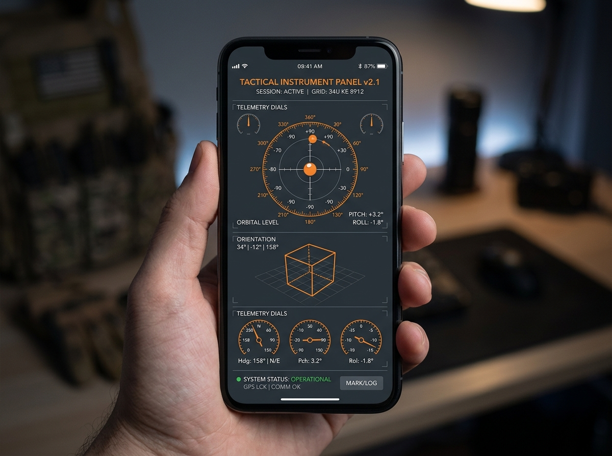

# Mobile Sensor Instrument Panel

An interactive WebGL 3D dashboard for monitoring and visualizing mobile device orientation and motion sensors (gyroscope and accelerometer), built with Three.js.

## Features
*   **System Telemetry**: Real-time yaw (alpha), pitch (beta), and roll (gamma) coordinate tracking.
*   **3D Bubble Level**: Flat, high-precision technical calibration indicator.
*   **3D Fluid Simulator**: WebGL sphere particles colliding inside a 3D gravity box.
*   **3D Glass Hourglass**: Cylindrical coordinate physics simulation of falling sand.
*   **Gyro Orientation Box**: Translucent wireframe box rotating with device motion.
*   **Camera Parallax**: Perspective camera depth shifting based on physical tilt.

## Deployment & Links
*   **Live Demo**: [GitHub Pages](https://holynova.github.io/mobile-sensor-playground/)
*   **GitHub Repository**: [GitHub Source Code](https://github.com/holynova/mobile-sensor-playground)
